# Task Board Application

A full-stack task management application with Kanban board functionality, AI-powered suggestions, and real-time updates. Built with Next.js, NestJS, PostgreSQL, and Google Gemini AI.

## 🎯 Overview

Task Board is a modern, production-ready task management system that helps users organize their work efficiently. It features a clean Kanban-style interface, drag-and-drop functionality, intelligent AI suggestions, and a robust backend API.

## ✨ Key Features

- 🔐 **Secure Authentication** - JWT-based auth with Supabase integration
- ✅ **Task Management** - Create, read, update, delete tasks with status tracking
- 🎨 **Kanban Board** - Drag-and-drop tasks between TODO, IN_PROGRESS, and DONE columns
- 🤖 **AI-Powered Suggestions** - Get intelligent task recommendations using Google Gemini
- 📧 **Email Notifications** - Automated email alerts for task activities
- 🔑 **API Key Management** - Secure programmatic access to the API
- 🌓 **Dark/Light Theme** - User preference with persistent theme selection
- 📱 **Responsive Design** - Optimized for desktop, tablet, and mobile
- 📊 **API Documentation** - Interactive Swagger/OpenAPI documentation
- 🐳 **Docker Ready** - Containerized deployment for both client and server

## 🏗️ Architecture

### Technology Stack

#### Frontend (Client)
- **Framework:** Next.js 15 with Turbopack
- **UI Library:** React 19
- **Styling:** Tailwind CSS
- **Components:** Radix UI primitives + shadcn/ui
- **State Management:** Zustand
- **Forms:** React Hook Form + Zod validation
- **Drag & Drop:** @dnd-kit
- **HTTP Client:** Axios

#### Backend (Server)
- **Framework:** NestJS
- **Language:** TypeScript
- **Database:** PostgreSQL
- **ORM:** Prisma
- **Authentication:** Passport JWT + Supabase
- **AI:** Google Generative AI (Gemini)
- **Email:** Nodemailer
- **Testing:** Jest + Supertest
- **API Docs:** Swagger/OpenAPI

## 📊 Application Flow
[](https://mermaid.live/edit#pako:eNqFU91u0zAUfhXL3IDUVk3WpE0ukNp1jE5jKksG0tIJuanbmiVxsR3UsfYNkBg_mgQ3vRniFbjiYXgB9gjYTpYlMGm5iHzO953jL-c7OYchnWDowhlDiznwe6MEyIen4yyxHRGciGAErzeX3__8_ACeMJoInExAHRzgpWi85iN4khWp52gQHGIUCrBN4wVNZC0voZ5AAgfHKRdIdtBRCe0OB6_y-7pLQrlK5AJylrw3O_yj0sPsLWZS5e9vX5XIHgpPbzRysedVJMquweGO56tDOZ2KeaBeYDdFbFKRLduTEPOgl3KSYM7BPp2R8B5RO0uBWYIiPbz3F0VctKuo8tIFGiOOg-vNl4si0qpKrF0ck4RIztUl2KV0FuE8Bbrlb_Ge-UNJ-vwD7MSIRDq-b4SCMjTDWuynX6CPBLrJVXT2e8HDIeVixrD3fF_zlNBHd7c_4tKW683HK306AfX6Y7kiOTbQod6CLKOPOnm7ChlyGyt49dT3h-AQv0mlu3yl0IKWlcup5RllqCp5gSIyUe33XvqrYr5V0q0zSdl2DfV7_ydX3QHwET-VEjIX7qAcUEGmJESC0ETylBOV-Ysz6WH-aVMSRe6DJkYWdspwtt45bDTHTscow8ViZYSp5eDmuFKf-ZjjnbEVTm1Yk788mUBXsBTXYIyZ3BQZwnNVOYJijmPpvCuPE8ROR3CUrGXNAiXHlMY3ZYymszl0pyjiMkoXasJ9guRKxUWWyZ3AbJumiYBuy2zrJtA9h0voGh2zYdmmuWVsWZ1WyzGtGjyDbt1wjEa72bZts9NsGq0tx17X4Dt9sdEwbKdt2o7d7hiGrLLWfwHr9IQa)

### 🔍 Architecture Details:

**Frontend (Next.js)**
- 🎨 **React Components**: UI rendered with shadcn/ui + Radix
- 📦 **Zustand State**: Centralized state management
- 🌐 **Axios Client**: HTTP client with interceptors

**Backend (NestJS)**
- 🛣️ **REST API**: RESTful endpoints with Swagger docs
- 🔒 **Auth Guards**: JWT & API Key validation
- ⚙️ **Services**: Task, Email, AI business logic

**External Services**
- 🔐 **Supabase**: User authentication & JWT tokens
- 🤖 **Gemini AI**: Task suggestions & recommendations
- 📧 **SMTP**: Email notifications (Nodemailer)

**Data Storage**
- 💾 **PostgreSQL**: Relational database with Prisma ORM

## 🔄 User Journey
[![](https://mermaid.ink/img/pako:eNqNVdFu0zAU_ZUrP4Ho0jZpuy0Pk7Z2mjpgbEs3JNQXN7lLzVK7OA7bmPYNIECT4IUXEL_AEx_DD8AnYCddlzVJt7y0to-Pj0_OvbkkvgiQuCTGNwlyH3uMhpJOhhz0Q30lJBzFKLPxlErFfDalXEE3Yqh_aAz_vl3_-PvrPezhubJex7OV4g4P5VuUZsefr1-yDbHa9WbzRfxmosYZ_-cP4CVTOqIxFmG9rQz08Tfsi1iFEr2DZyVs_Qz2_Rp2cMI40zNF1PaEsigDfvoJ3vPB_pBnKPPsCYUgzCWMJzUj0IWmlSrVV2Y-VUzk8Aa1srGRGeLCNld6qy8xMGAaxbfIDKKxmRku7L_wBlCnU1anmrweiZDliDOUhmcSjmnEAqq1JfNXZR6zuJLj3H05ACVOsUiUE2k0w5NF3FzfDczTyUBgHHwhThkWkBpqmFw4xIBJ9JVmhB6NxyNBZbDE1N6WC7YFzwQNYEDj07jSzmOGZ3nKSi93tmdWqrt8cxfNmQcJygtYQPS28v4ZORCxWC3z7xBVIvki0aIrPRZPI3oBTykfUQ73mZLG0gXHgq5E86KNlEpjNoMAuPZG3QEtidgyX_pck6sFrhJf_FRYUMIyE-8h17KEYieFOim6uDeTDzrWtNrGo2ka-6P-sirtu9CyTP17SRjqlqOPrg7VoemDcdouxhhNH5yqelxGflunWsQOcpRGbil0s1-wlAVI4wdkrZRv0SpvLM4g0F1HhJWX9zBKK7U0u5XBgUcjqvzx4_sDVFlZXcFPmJyUxCenLot-cF9pzTKRawqkRkLJAuIqmWCNTFDqROohuTTrQ6Kb9wSHxNV_AypPh2TIr_Qe_UF4JcTkZpsUSTgm7onu23qUpKfMvpbzWakzjrIrEq6I2-60UxLiXpJzPWxZ7Y7TaTedpt3qOC2nRi6Iu7JqNyzbaTTXWva63XAazlWNvEuPbVqdtc7q2rqZb67abdu5-g-olGvX?type=png)](https://mermaid.live/edit#pako:eNqNVdFu0zAU_ZUrP4Ho0jZpuy0Pk7Z2mjpgbEs3JNQXN7lLzVK7OA7bmPYNIECT4IUXEL_AEx_DD8AnYCddlzVJt7y0to-Pj0_OvbkkvgiQuCTGNwlyH3uMhpJOhhz0Q30lJBzFKLPxlErFfDalXEE3Yqh_aAz_vl3_-PvrPezhubJex7OV4g4P5VuUZsefr1-yDbHa9WbzRfxmosYZ_-cP4CVTOqIxFmG9rQz08Tfsi1iFEr2DZyVs_Qz2_Rp2cMI40zNF1PaEsigDfvoJ3vPB_pBnKPPsCYUgzCWMJzUj0IWmlSrVV2Y-VUzk8Aa1srGRGeLCNld6qy8xMGAaxbfIDKKxmRku7L_wBlCnU1anmrweiZDliDOUhmcSjmnEAqq1JfNXZR6zuJLj3H05ACVOsUiUE2k0w5NF3FzfDczTyUBgHHwhThkWkBpqmFw4xIBJ9JVmhB6NxyNBZbDE1N6WC7YFzwQNYEDj07jSzmOGZ3nKSi93tmdWqrt8cxfNmQcJygtYQPS28v4ZORCxWC3z7xBVIvki0aIrPRZPI3oBTykfUQ73mZLG0gXHgq5E86KNlEpjNoMAuPZG3QEtidgyX_pck6sFrhJf_FRYUMIyE-8h17KEYieFOim6uDeTDzrWtNrGo2ka-6P-sirtu9CyTP17SRjqlqOPrg7VoemDcdouxhhNH5yqelxGflunWsQOcpRGbil0s1-wlAVI4wdkrZRv0SpvLM4g0F1HhJWX9zBKK7U0u5XBgUcjqvzx4_sDVFlZXcFPmJyUxCenLot-cF9pzTKRawqkRkLJAuIqmWCNTFDqROohuTTrQ6Kb9wSHxNV_AypPh2TIr_Qe_UF4JcTkZpsUSTgm7onu23qUpKfMvpbzWakzjrIrEq6I2-60UxLiXpJzPWxZ7Y7TaTedpt3qOC2nRi6Iu7JqNyzbaTTXWva63XAazlWNvEuPbVqdtc7q2rqZb67abdu5-g-olGvX)

### 📝 Journey Steps:
1. **Authentication** - User logs in with Supabase
2. **Load Tasks** - Fetch and display user's tasks
3. **Create Task** - Add task with email notification
4. **AI Suggestions** - Get AI-powered task recommendations

## 🗄️ Database Schema (ERD)

Our application uses PostgreSQL with the following schema:


**Note:** For a detailed visual ERD, see [server/prisma/ERD.svg](server/prisma/ERD.svg)

### Database Models

#### Task
- Stores user tasks with status tracking
- **Status:** TODO | IN_PROGRESS | DONE
- Indexed by userId and status for fast queries

#### EmailLog
- Tracks all email notifications
- **Status:** PENDING | SENT | FAILED
- Records delivery status and errors

#### EmailTemplate
- Customizable email templates
- **Types:** TASK_CREATED | TASK_UPDATED | TASK_DELETED | SUMMARY_TASKS_DAILY

#### ApiKey
- Manages API access keys for programmatic access
- Supports expiration and revocation
- Alternative authentication method to JWT

## 🚀 Getting Started

### Prerequisites

- Node.js 18 or higher
- PostgreSQL database
- Supabase account
- Google Gemini API key
- Yarn or npm package manager

### Quick Start

1. **Clone the repository**
```bash
git clone <repository-url>
cd task-board
```

2. **Setup Server**
```bash
cd server
npm install

# Create .env file with required variables
cp .env.example .env

# Setup database
npx prisma generate
npx prisma migrate dev

# Start server
npm run start:dev
```

3. **Setup Client**
```bash
cd client
yarn install

# Create .env.local file
echo "NEXT_PUBLIC_API_URL=http://localhost:3001" > .env.local

# Start client
yarn dev
```

4. **Access the application**
- Frontend: http://localhost:3000
- Backend API: http://localhost:3001
- API Documentation: http://localhost:3001/api/docs

### Environment Variables

#### Server (.env)
```env
# App Configuration
PORT=3001
NODE_ENV=development
REQUEST_TIMEOUT=30000

# Supabase Configuration
SUPABASE_URL="your-supabase-url"
SUPABASE_ANON_KEY="your-supabase-anon-key"
SUPABASE_SERVICE_ROLE_KEY="your-supabase-service-role-key"
SUPABASE_JWT_SECRET="your-supabase-jwt-secret"

# CORS Configuration
ALLOWED_ORIGINS="http://localhost:3000,http://localhost:3001"

# Google AI (Gemini)
GEMINI_API_KEY="your-google-gemini-api-key"

# SMTP Email Configuration
SMTP_HOST="smtp.gmail.com"
SMTP_PORT=587
SMTP_USER="your-email@gmail.com"
SMTP_PASS="your-email-password"
SMTP_SENDER_NAME="Task Board App"
```

**Note**: The `SUPABASE_JWT_SECRET` can be found in your Supabase dashboard under Settings > API > JWT Settings.

#### Client (.env.local)
```env
# Backend API URL
NEXT_PUBLIC_API_URL=http://localhost:3001

# API Request Timeout (in milliseconds, optional - defaults to 30000)
NEXT_PUBLIC_API_TIMEOUT=30000

# App Configuration (optional)
PORT=3000
NODE_ENV=development
```

## 🐳 Docker Deployment

### Using Docker Compose

```bash
# Build and start all services
docker-compose up -d

# View logs
docker-compose logs -f

# Stop services
docker-compose down
```

### Individual Services

**Server:**
```bash
cd server
docker build -t task-board-server .
docker run -p 3001:3001 task-board-server
```

**Client:**
```bash
cd client
docker build -t task-board-client .
docker run -p 3000:3000 task-board-client
```

## 📚 Documentation

- **Client README:** [client/README.md](client/README.md)
- **Server README:** [server/README.md](server/README.md)
- **API Documentation:** Available at `/api/docs` when server is running
- **Database Schema:** [server/prisma/schema.prisma](server/prisma/schema.prisma)
- **ERD Diagram:** [server/prisma/ERD.svg](server/prisma/ERD.svg)

## 🔐 Authentication & Security

- JWT token-based authentication with Supabase
- API key authentication for programmatic access
- Secure password handling via Supabase
- CORS protection with configurable policies
- Input validation using Zod and class-validator
- SQL injection protection via Prisma ORM
- HTTP-only cookies for token storage

## 🧪 Testing

### Server Tests
```bash
cd server

# Run all tests
npm test

# Run with coverage
npm run test:cov

# Run e2e tests
npm run test:e2e
```

### Client Tests
```bash
cd client

# Run linter
yarn lint
```

## 📁 Project Structure

```
task-board/
├── client/                 # Next.js frontend application
│   ├── src/
│   │   ├── app/           # Next.js app directory
│   │   ├── components/    # React components
│   │   ├── hooks/         # Custom React hooks
│   │   ├── services/      # API services
│   │   └── types/         # TypeScript types
│   └── public/            # Static assets
│
├── server/                # NestJS backend application
│   ├── src/
│   │   ├── api/          # API modules (auth, tasks, etc.)
│   │   ├── auth/         # Auth guards & strategies
│   │   ├── config/       # Configuration files
│   │   ├── core/         # Core functionality
│   │   └── shared/       # Shared resources
│   ├── prisma/           # Database schema & migrations
│   └── test/             # Test files
│
└── README.md             # This file
```


## 🙏 Acknowledgments

- [Next.js](https://nextjs.org/) - React framework
- [NestJS](https://nestjs.com/) - Node.js framework
- [Prisma](https://www.prisma.io/) - Database ORM
- [Supabase](https://supabase.com/) - Authentication service
- [Google Gemini](https://ai.google.dev/) - AI integration
- [shadcn/ui](https://ui.shadcn.com/) - UI components
- [Radix UI](https://www.radix-ui.com/) - UI primitives


**Built with ❤️ using Next.js and NestJS**
