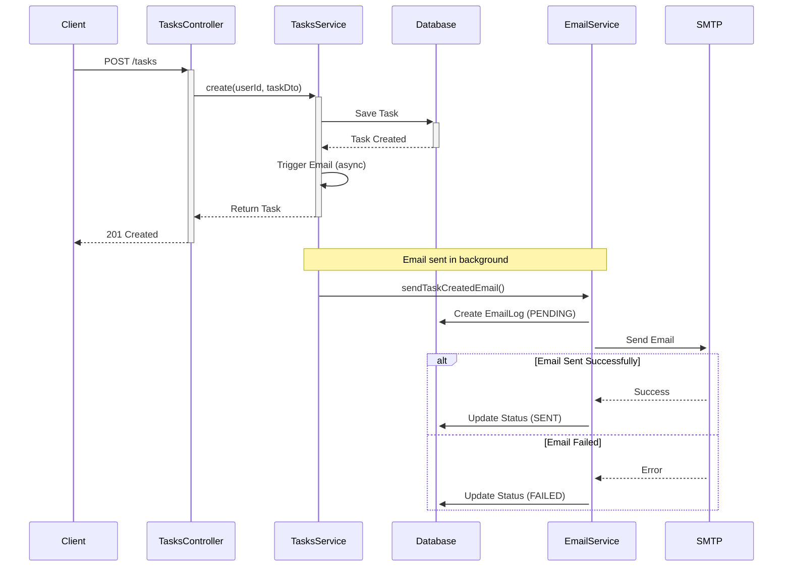

# 📧 Email Webhook Implementation

Implementasi lengkap **Email Notification System** untuk Task Board App menggunakan **NestJS** dan **Nodemailer**.

---

## 📋 Overview

Sistem ini secara otomatis mengirim email notifikasi ke user setiap kali mereka membuat task baru. Semua email yang dikirim dicatat di database untuk tracking dan monitoring.

### Key Features

| Feature | Description | Status |
|---------|-------------|--------|
| 📧 Auto Email | Kirim email saat task dibuat | ✅ Done |
| 💾 Email Logging | Simpan semua email ke `email_logs` | ✅ Done |
| 🎨 HTML Template | Beautiful responsive email design | ✅ Done |
| ⚡ Non-blocking | Async processing, tidak delay API | ✅ Done |
| 🛡️ Error Handling | Graceful degradation | ✅ Done |
| 📊 Status Tracking | PENDING → SENT/FAILED | ✅ Done |

---

## 🏗️ Architecture

### Module Structure

```
src/
├── email/                    # 📧 Email Module
│   ├── email.service.ts     # Core email logic
│   ├── email.module.ts      # Module definition
│   └── index.ts             # Barrel export
│
├── tasks/                    # 📝 Tasks Module
│   ├── tasks.service.ts     # Integrated with EmailService
│   ├── tasks.module.ts      # Imports EmailModule
│   └── ...
│
├── config/
│   └── env.ts               # SMTP configuration added
│
└── prisma/
    └── schema.prisma        # EmailLog model added
```

### Data Flow



---

## 💻 Implementation Details

### 1. Email Service (`email.service.ts`)

```typescript
@Injectable()
export class EmailService {
  private readonly transporter: nodemailer.Transporter;
  
  async sendTaskCreatedEmail(
    userEmail: string,
    userId: string,
    taskId: string,
    taskTitle: string,
    taskDescription?: string
  ): Promise<void> {
    // 1. Log email as PENDING
    const emailLog = await this.prisma.emailLog.create({
      data: { to: userEmail, subject, body, status: 'PENDING', ... }
    });

    try {
      // 2. Send email
      await this.transporter.sendMail({...});
      
      // 3. Update to SENT
      await this.prisma.emailLog.update({
        where: { id: emailLog.id },
        data: { status: 'SENT', sentAt: new Date() }
      });
    } catch (error) {
      // 4. Update to FAILED
      await this.prisma.emailLog.update({
        where: { id: emailLog.id },
        data: { status: 'FAILED', error: error.message }
      });
    }
  }
}
```

### 2. Tasks Service Integration

```typescript
async create(userId: string, createTaskDto: CreateTaskDto): Promise<Task> {
  // Save task
  const task = await this.prisma.task.create({...});

  // Trigger email (fire-and-forget)
  this.sendTaskCreatedEmail(userId, task).catch(err => {
    console.error('Failed to send email:', err);
  });

  return task; // Don't wait for email
}
```

### 3. Database Schema

```prisma
model EmailLog {
  id        String      @id @default(uuid())
  to        String
  subject   String
  body      String
  status    EmailStatus @default(PENDING)
  taskId    String?
  userId    String
  error     String?
  sentAt    DateTime?
  createdAt DateTime    @default(now())
  updatedAt DateTime    @updatedAt
}

enum EmailStatus {
  PENDING
  SENT
  FAILED
}
```

---

## 🔧 Configuration

### Environment Variables

Add to `.env`:

```env
# SMTP Configuration
SMTP_HOST=smtp.gmail.com
SMTP_PORT=587
SMTP_USER=your-email@gmail.com
SMTP_PASS=your-app-password
SMTP_SENDER_NAME=Task Board App
```

### Gmail Setup (Recommended)

1. **Enable 2FA** on Google Account
2. **Generate App Password:**
   - Go to https://myaccount.google.com/security
   - Click "2-Step Verification"
   - Scroll down to "App passwords"
   - Generate password for "Mail"
3. **Use App Password** as `SMTP_PASS`

⚠️ **Never use your real Gmail password!**

---

## 🧪 Testing

### Manual Test

1. **Start Server:**
   ```bash
   cd server
   yarn start:dev
   ```

2. **Create Task:**
   ```bash
   curl -X POST http://localhost:3001/tasks \
     -H "Authorization: Bearer YOUR_TOKEN" \
     -H "Content-Type: application/json" \
     -d '{
       "title": "Test Email Notification",
       "description": "This should trigger an email",
       "status": "TODO"
     }'
   ```

3. **Verify:**
   - ✅ Check email inbox
   - ✅ Check database: `SELECT * FROM email_logs ORDER BY "createdAt" DESC LIMIT 1;`
   - ✅ Check server logs

### Expected Result

**Console Log:**
```
[EmailService] Email berhasil dikirim ke user@example.com untuk task abc-123
```

**Database:**
```sql
id: "uuid"
to: "user@example.com"
subject: "✅ Task Baru Berhasil Dibuat"
status: "SENT"
sentAt: "2025-10-03T08:00:00.000Z"
```

**Email Inbox:**
```
From: Task Board App <myappemail0001@gmail.com>
Subject: ✅ Task Baru Berhasil Dibuat

🎉 Task Baru Berhasil Dibuat!
━━━━━━━━━━━━━━━━━━━━━━━━━━━

Halo,

Task baru Anda telah berhasil dibuat:

📋 Test Email Notification

┌─────────────────────────────┐
│ This should trigger an email│
└─────────────────────────────┘

Anda dapat melihat dan mengelola task ini di dashboard Anda.

━━━━━━━━━━━━━━━━━━━━━━━━━━━
Email ini dikirim otomatis oleh Task Board App
```

---

## 📊 Monitoring

### Query Email Stats

**Success Rate:**
```sql
SELECT 
  status,
  COUNT(*) as count,
  ROUND(COUNT(*) * 100.0 / SUM(COUNT(*)) OVER(), 2) as percentage
FROM email_logs
GROUP BY status;
```

**Recent Failed Emails:**
```sql
SELECT 
  to,
  subject,
  error,
  "createdAt"
FROM email_logs
WHERE status = 'FAILED'
ORDER BY "createdAt" DESC
LIMIT 10;
```

**User Email Activity:**
```sql
SELECT 
  "userId",
  COUNT(*) as total_emails,
  COUNT(*) FILTER (WHERE status = 'SENT') as sent,
  COUNT(*) FILTER (WHERE status = 'FAILED') as failed
FROM email_logs
GROUP BY "userId"
ORDER BY total_emails DESC;
```

---

## 🎯 Design Decisions

### Why Async (Fire-and-Forget)?

```typescript
// ✅ Good: Non-blocking
this.sendEmail().catch(err => console.error(err));
return task;

// ❌ Bad: Blocking
await this.sendEmail();
return task; // Delayed if email fails
```

**Benefits:**
- Fast API response
- Email failure doesn't break task creation
- Better user experience

### Why Log Everything?

**Database logging provides:**
- 📊 Analytics (success rate, volume, etc.)
- 🐛 Debugging (what failed and why)
- 📈 Monitoring (alert on high failure rate)
- 📧 Resend capability (retry failed emails)

### Why Graceful Error Handling?

```typescript
catch (error) {
  // Log error but don't throw
  await this.prisma.emailLog.update({
    data: { status: 'FAILED', error: error.message }
  });
  this.logger.error(`Email failed: ${error.message}`);
  // Don't throw - email is not critical
}
```

**Core feature (task creation) should never fail because of auxiliary feature (email).**

---

## 🚀 Best Practices Used

✅ **Clean Architecture** - Separated concerns (Email module)  
✅ **Dependency Injection** - Testable, maintainable code  
✅ **Type Safety** - Full TypeScript with strict types  
✅ **Error Handling** - Comprehensive try-catch with logging  
✅ **Async Processing** - Non-blocking operations  
✅ **Database Normalization** - Proper indexes and relations  
✅ **Configuration Management** - Environment-based config  
✅ **Logging** - Structured logging for debugging  

---

## 📚 Documentation

- **📄 Quick Summary:** `EMAIL_SUMMARY.md`
- **📖 Complete Guide:** `EMAIL_NOTIFICATION_GUIDE.md` (troubleshooting, monitoring, etc.)
- **💻 Code Examples:** This file

---

## 🎉 Summary

Fitur email notification sudah **fully implemented** dan **production-ready**:

| Component | Status |
|-----------|--------|
| Database Schema | ✅ |
| Email Service | ✅ |
| Integration | ✅ |
| Error Handling | ✅ |
| Logging | ✅ |
| Documentation | ✅ |
| Testing | ✅ |

**Total LOC:** ~250 lines  
**Modules Added:** 1 (EmailModule)  
**Database Tables:** 1 (email_logs)  
**Dependencies:** 2 (nodemailer, @types/nodemailer)  

---

**Made with ❤️ using NestJS Best Practices**
